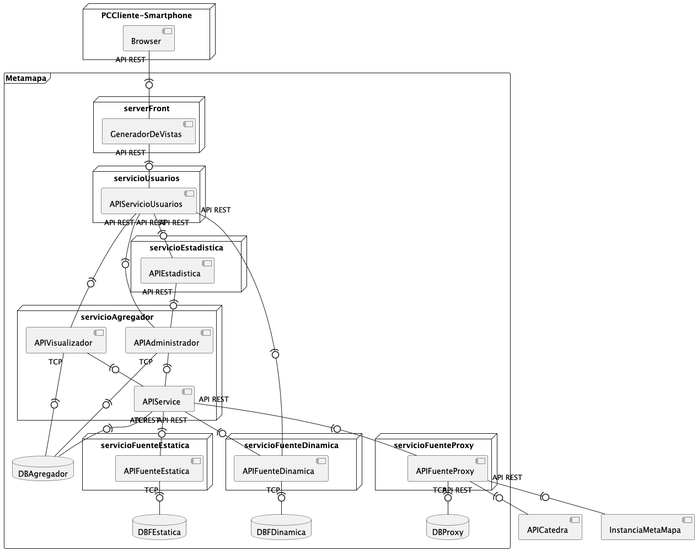

# 🗺️ Metamapa 


MetaMapa es una plataforma web compuesta por **microservicios**, diseñada para **agregar**, **procesar** y **visualizar** **hechos** provenientes de diversas fuentes: estáticas, dinámicas y externas.
Fue desarrollada en **Java 17 + Spring Boot**, como parte de un trabajo práctico de Diseño de Sistemas (2025).

---

## 🧩 Overview

El sistema permite:
- Autenticación y administración de usuarios
- Ingesta de hechos desde múltiples fuentes (Estática (CSV/TCP), Dinámica (API externa), Proxy (API de cátedra))
- Normalización y agregación de información
- Visualización web mediante un front MVC (Thymeleaf)
- Generación y consulta de estadísticas

Cada responsabilidad está encapsulada en un microservicio independiente que se comunica mediante API REST o TCP

---

## 🧱 Arquitectura del Sistema

> La arquitectura fue diseñada siguiendo principios de separación de responsabilidades, bajo un esquema de microservicios desacoplados

### 📝 Descripción general

- **clienteInterfaz** : Front web MVC donde los usuarios navegan, inician sesión y visualizan hechos

- **servicioUsuario** : Actúa como servicio de identidad (login/validación) y gateway lógico. Centraliza la autenticación y redirige solicitudes autorizadas hacia los demás servicios
  
- **servicioEstadistica** : Expone estadísticas agregadas desde la base del agregador

- **servicioAgregador** : Núcleo de procesamiento: recibe hechos, los normaliza y los almacena

- **servicioFuenteEstatica** : Fuente de datos estática (CSV) vía TCP

- **servicioFuenteDinamica** : Fuente externa dinámica vía API REST

- **servicioFuenteProxy** : Fuente externa provista por la cátedra, consumida vía REST

---

## 📦 Módulos del Proyecto

| Módulo                     | Descripción                                             |
| -------------------------- | ------------------------------------------------------- |
| **clienteInterfaz**        | Front MVC con Thymeleaf, interacción con usuarios       |
| **servicioUsuario**        | Servicio de identidad (auth) y punto de entrada hacia otros microservicios. Gestiona usuarios en MySQL             |
| **servicioEstadistica**    | Generación y publicación de estadísticas                |
| **servicioAgregador**      | Orquestación, normalización de hechos y almacenamiento  |
| **servicioFuenteEstatica** | Ingesta de datos CSV vía TCP                            |
| **servicioFuenteDinamica** | Ingesta de datos externos vía REST                      |
| **servicioFuenteProxy**    | Integración con la API oficial de la cátedra            |
| **entregables**            | Documentación y entregas académicas                     |

---

## 📥 Clonar el proyecto

```bash
git clone https://github.com/valenap-utn/metamapa-utn-2025.git
cd metamapa-utn-2025
```

---

## 🚀 Cómo levantar el proyecto

### 🧩 Requisitos

| Sistema | Requisitos |
|----------|-------------|
| **macOS / Linux** | Tener instalados:<br>• [Java 17+](https://adoptium.net/)<br>• [Maven](https://maven.apache.org/) (`brew install openjdk@17 maven` en macOS)<br>• Acceso a internet para dependencias de Maven |
| **Windows** | Instalar:<br>• [Java 17+](https://adoptium.net/)<br>• [Maven](https://maven.apache.org/download.cgi)<br>• Agregar `JAVA_HOME` y `MAVEN_HOME` al PATH si fuera necesario |

Verificá la instalación con:
```bash
java -version
mvn -version
```

---

## ⚙️ Configuración de MySQL

Ejemplo extraído del proyecto:

```properties
spring.datasource.url=jdbc:mysql://localhost:3306/db_usuarios?useSSL=false&serverTimezone=UTC&createDatabaseIfNotExist=true
spring.datasource.username=root
spring.datasource.password=contrasenia
spring.datasource.driver-class-name=com.mysql.cj.jdbc.Driver
```


Cada microservicio que use BD debe tener su propio esquema.

---

### ⚙️ Configuración de OAuth2
El módulo clienteInterfaz soporta autenticación vía OAuth2

Por lo tanto en application.properties debería de haber algo como esto:

```properties
# ---- OAuth2 (Google / GitHub) ----
spring.security.oauth2.client.registration.google.client-id=${GOOGLE_CLIENT_ID}
spring.security.oauth2.client.registration.google.client-secret=${GOOGLE_CLIENT_SECRET}
spring.security.oauth2.client.registration.github.client-id=${GITHUB_CLIENT_ID}
spring.security.oauth2.client.registration.github.client-secret=${GITHUB_CLIENT_SECRET}
```

> 💡 Las credenciales (`GOOGLE_CLIENT_ID`, etc.) deben definirse como variables de entorno o en un archivo `.env` local (no versionado).

#### 🔧 Definir variables de entorno

**macOS / Linux**

```bash
export GOOGLE_CLIENT_ID=tu_client_id
export GOOGLE_CLIENT_SECRET=tu_client_secret
export GITHUB_CLIENT_ID=tu_client_id
export GITHUB_CLIENT_SECRET=tu_client_secret
```

**Windows (PowerShell)**

```powershell
setx GOOGLE_CLIENT_ID "tu_client_id"
setx GOOGLE_CLIENT_SECRET "tu_client_secret"
setx GITHUB_CLIENT_ID "tu_client_id"
setx GITHUB_CLIENT_SECRET "tu_client_secret"
```

---

 ### 🔑 Cómo generar credenciales OAuth2
 
<details><summary>Para Google</summary>
   
#### 🟦 Google
1. Ingresá a [Google Cloud Console](https://console.cloud.google.com/).
2. Creá un nuevo proyecto o usá uno existente.
3. Activá la API **OAuth consent screen** (pantalla de consentimiento).
4. En la sección **Credentials → Create credentials → OAuth client ID**, elegí:
   - Application type: **Web application**
   - Authorized redirect URI:  
     ```
     http://localhost:8080/login/oauth2/code/google
     ```
5. Guardá los valores generados (`Client ID` y `Client Secret`) y definilos como variables de entorno según tu sistema operativo:

##### 💻 macOS / Linux
```bash
export GOOGLE_CLIENT_ID=tu_client_id
export GOOGLE_CLIENT_SECRET=tu_client_secret
```

##### 🪟 Windows (PowerShell)

```powershell
setx GOOGLE_CLIENT_ID "tu_client_id"
setx GOOGLE_CLIENT_SECRET "tu_client_secret"
```

</details>

<details><summary>Para Github</summary>
   
#### 🐙 GitHub

1. Ingresá a [GitHub Developer Settings → OAuth Apps](https://github.com/settings/developers).
2. Clic en **New OAuth App**.
3. Completá los campos:

   * **Homepage URL:** `http://localhost:8080`
   * **Authorization callback URL:**

     ```
     http://localhost:8080/login/oauth2/code/github
     ```
4. Una vez creado, copiá el `Client ID` y generá un nuevo `Client Secret`.
5. Definilos como variables de entorno según tu sistema operativo:

##### 💻 macOS / Linux

```bash
export GITHUB_CLIENT_ID=tu_client_id
export GITHUB_CLIENT_SECRET=tu_client_secret
```

##### 🪟 Windows (PowerShell)

```powershell
setx GITHUB_CLIENT_ID "tu_client_id"
setx GITHUB_CLIENT_SECRET "tu_client_secret"
```

</details>


> ⚠️ **Importante:** nunca subas tus credenciales reales a GitHub.
> Guardalas solo en tu entorno local (por ejemplo, en un archivo `.env` o en tu configuración de sistema) y asegurate de que estén incluidas en el `.gitignore`.

---

## ▶️ Ejecución

Cada servicio se ejecuta por separado:

```bash
cd servicioAgregador
mvn spring-boot:run
```

Levantar también:

```bash
clienteInterfaz
servicioUsuario
servicioEstadistica
servicioFuenteEstatica
servicioFuenteDinamica
servicioFuenteProxy
```


Luego abrir:

👉 http://localhost:8080

---

## 🛠 Tecnologías Principales

- Java 17
- Spring Boot 3
- Spring MVC
- Spring WebClient
- Thymeleaf
- MySQL
- Maven
- REST + TCP

---

## 🎓 Proyecto académico

Trabajo práctico anual – Diseño de Sistemas (UTN - FRBA, 2025)
